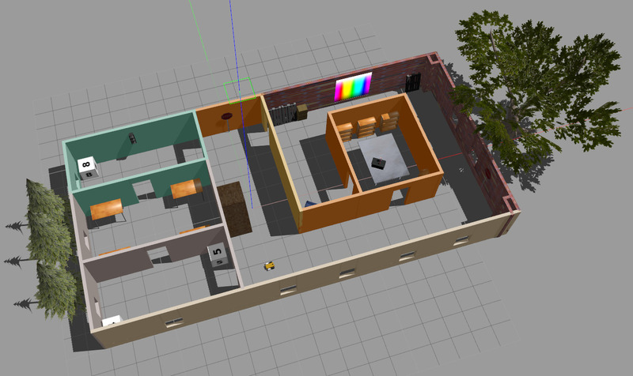

# RoboND Map My World

This project is about performing SLAM using RGB-D based 
Real-Time Appearance-Based Mapping via the RTAB-Map algorithm.
It utilizes ROS' [`rtabmap`](http://wiki.ros.org/rtabmap) and
[`rtabmap_ros`](http://wiki.ros.org/rtabmap_ros) packages and
is developed against ROS Kinetic.


To build the project, you can try executing `./run_nvidia.sh` to drop
into an X11 aware Docker container with NVIDIA GPU support.

---

The following three pictures show the simulation environment and SLAM results of
the [RTAB-Map](http://wiki.ros.org/rtabmap_ros) node, as well as the map generated by it.
For more information about RTAB-Map, see also the [offical website](http://introlab.github.io/rtabmap/).

**The simulated environment:**



**Nodes of the graph** generated by generated by RTAB-Map (after 
111 rounds of global loop closure):


**The 2D map** generated by RTAB-Map:


## Environment and Robot Control

To run, execute:

```bash
roslaunch map_my_world world.launch
```

We can use keyboard teleop to control the bot manually:

```bash
rosrun teleop_twist_keyboard teleop_twist_keyboard.py
```

## SLAM

To perform mapping (thereby deleting any already existing map) we can run

```bash
roslaunch map_my_world mapping.launch
```


If a map already exists, we can also choose to enter localization mode
by running

```bash
roslaunch map_my_world localization.launch
```


To inspect the created map, run

```bash
rtabmap-databaseViewer ~/.ros/rtabmap.db
```


## Papers

- [RTAB-Map as an Open-Source Lidar and Visual
   SLAM Library for Large-Scale and Long-Term Online
   Operation](papers/Labbe18JFR_preprint.pdf) (Mathieu Labbé, François Michaud; 2019)

> Distributed as an open source library since 2013, RTAB-Map started as an appearance-
  based loop closure detection approach with memory management to deal with large-scale
  and long-term online operation. It then grew to implement Simultaneous Localization and
  Mapping (SLAM) on various robots and mobile platforms. As each application brings
  its own set of contraints on sensors, processing capabilities and locomotion, it raises the
  question of which SLAM approach is the most appropriate to use in terms of cost, accuracy,
  computation power and ease of integration. Since most of SLAM approaches are either
  visual or lidar-based, comparison is difficult. Therefore, we decided to extend RTAB-Map
  to support both visual and lidar SLAM, providing in one package a tool allowing users to
  implement and compare a variety of 3D and 2D solutions for a wide range of applications
  with different robots and sensors. This paper presents this extended version of RTAB-Map
  and its use in comparing, both quantitatively and qualitatively, a large selection of popular
  real-world datasets (e.g., KITTI, EuRoC, TUM RGB-D, MIT Stata Center on PR2 robot),
  outlining strengths and limitations of visual and lidar SLAM configurations from a practical
  perspective for autonomous navigation applications.

## Building with CLion IDE

**Note:** This does not _really_ work, as CLion will be unable to find generated headers. It's still a bit
          better than doing everything the hard way.

The full requirements for setting up CLion are given in the [sunsided/robond-ros-docker](https://github.com/sunsided/robond-ros-docker)
repository. In short, run SSHD in Docker, configure a Remote Host build to connect to it, then configure
the your build settings for ROS. For this repo and the included Dockerfile, this configuration will do:

**CMake options:**

```
-DCATKIN_DEVEL_PREFIX:PATH=/workspace/devel -DCMAKE_PREFIX_PATH=/workspace/devel;/opt/ros/kinetic;/opt/ros/kinetic/share
```

**Environment:**

```
ROS_ROOT=/opt/ros/kinetic/share/ros;ROS_PACKAGE_PATH=/workspace/src:/opt/ros/kinetic/share;ROS_MASTER_URI=http://localhost:11311;ROS_PYTHON_VERSION=2;ROS_VERSION=1;ROSLISP_PACKAGE_DIRECTORIES=/workspace/devel/share/common-lisp;ROS_DISTRO=kinetic;ROS_ETC_DIR=/opt/ros/kinetic/etc/ros;PYTHONPATH=/opt/ros/kinetic/lib/python2.7/dist-packages;PKG_CONFIG_PATH=/workspace/devel/lib/pkgconfig:/opt/ros/kinetic/lib/pkgconfig:/opt/ros/kinetic/lib/x86_64-linux-gnu/pkgconfig;LD_LIBRARY_PATH=/workspace/devel/lib:/opt/ros/kinetic/lib:/opt/ros/kinetic/lib/x86_64-linux-gnu:$LD_LIBRARY_PATH;PATH=/opt/ros/kinetic/bin:$PATH
```
